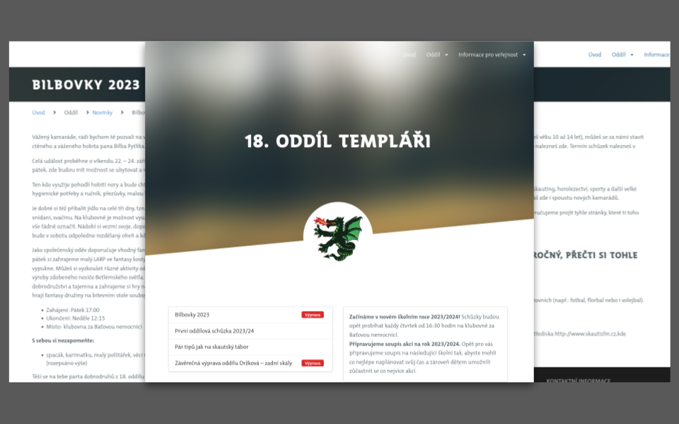

# Patron Theme



**Patron** is the theme for [Grav CMS](http://github.com/getgrav/grav). This theme was developed primarly for non profit organizations, such as Scout organization. Patron requires minimal version of Grav 1.7+, so you cannot run Patron on earlier versions of Grav.

## Features

- [ ] Fully responsive with full-page mobile navigation
- [x] Multiple page template types
- [ ] SCSS based CSS source files for easy customization
- [x] Robust theme config blueprint

### Supported Page Templates

* Default view template `default.md`
* Landing page view template `landing.md`
* Contacts view template `contacts.md`
* Error view template `error.md`
* Articles list view template `list-articles.md`
* Blog view template `list-gallery.md` (used for image gallery list)
* Gallery view template `gallery.md` (used for image gallery)

# Installation

Installing the Patron theme can be done in one of two ways. The Grav GPM (Grav Package Manager) installation method enables you to quickly and easily install the theme with a simple terminal command, while the manual method enables you to do so via a zip file. 

## GPM Installation (Preferred)

The simplest way to install this theme is via the [Grav Package Manager (GPM)](http://learn.getgrav.org/advanced/grav-gpm) through your system's Terminal (also called the command line).  From the root of your Grav install type:

    bin/gpm install patron

This will install the Patron theme into your `/user/themes` directory within Grav. Its files can be found under `/your/site/grav/user/themes/patron`.

## Manual Installation

To install this theme, just download the zip version of this repository and unzip it under `/your/site/grav/user/themes`. Then, rename the folder to `patron`. You can find these files either on [GitHub](https://github.com/praserx/grav-theme-patron) or via [GetGrav.org](http://getgrav.org/downloads/themes).

You should now have all the theme files under

    /your/site/grav/user/themes/patron

# Theme configuration

All configuration can be done via admin interface of Grav. There are multiple sections such as **Your organization** (essential information about your organization with some contacts), **Socials & Links** (Facebook link to configure and other links that can be added), **Settings** (basic settings like favicon, copyright, landing page info, etc.) and **Advanced Settings** (custom landing page section).

## Your organization settings

```
organization:
  main_contact:
    name: 'Acme inc.'
    address: 'Nice st. 458'
    country: 'USA'
    email: info@example.com
  headquarters:
    contacts:
      -
        name: 'John Doe'
        nickname: Johny
        title: 'Branch Director'
        phone: '+420 123 456 789'
        email: john@example.com
  logo:
    user/themes/patron/images/my_logo.png:
      name: my_logo.png
      type: image/png
      size: 314060
      path: user/themes/patron/images/my_logo.png
  background:
    user/themes/patron/images/header-bg.png:
      name: header-bg.png
      type: image/png
      size: 482368
      path: user/themes/patron/images/header-bg.png
  description: 'Lorem ipsum dolor sit amet'
```

## Socials & Links settings

```
socials:
  facebook: 'https://www.facebook.com/skautizlin'
  links:
    'stautizlin.cz | Středisko Impeesa Zlín': 'https://www.skautizlin.cz'
    'skaut.cz | Oficiální skautský web': 'https://www.skaut.cz/'
    'krizovatka.skaut.cz | Skautská křižovatka': 'https://krizovatka.skaut.cz/'
```

## Essential settings

```
settings:
  copyright: 'Copy here'
  additional_page_info: 'Additional info here'
  flash_news_path: /path/to/news
  sticky_info: "Landing page short sticky info!"
  favicon:
    user/themes/patron/images/favicon.png:
      name: favicon.png
      type: image/png
      size: 11609
      path: user/themes/patron/images/favicon.png
  show_login: true
  banner_text: 'Hey! Some text here!'
```

# Found a bug?

It is not perfect and there is so much to do. So if you want improve something or if you find a bug, please create new issue.
