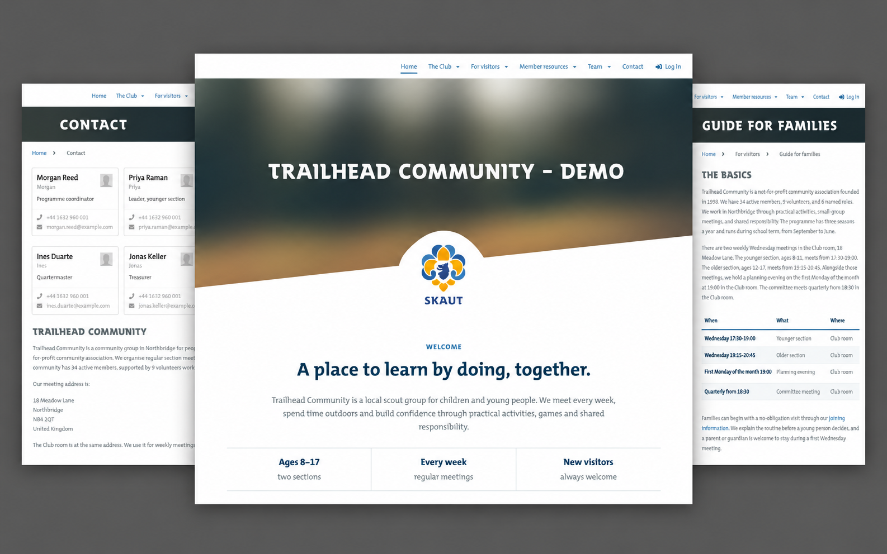

# Patron Theme



**Patron** is the theme for [Grav CMS](http://github.com/getgrav/grav). This theme was developed primarly for non profit organizations, such as Scout organization. Patron requires minimal version of Grav 1.7+, so you cannot run Patron on earlier versions of Grav.

## Features

- [x] Fully responsive with full-page mobile navigation
- [x] Multiple page template types
- [x] Robust theme config blueprint

### Supported Page Templates

* Default view template `default.md`
* Landing page view template `landing.md`
* Contacts view template `contacts.md`
* Error view template `error.md`
* Articles list view template `list-articles.md`
* Blog view template `list-gallery.md` (used for image gallery list)
* Gallery view template `gallery.md` (used for image gallery)

# Installation

Installing the Patron theme can be done in one of two ways. The Grav GPM (Grav Package Manager) installation method enables you to quickly and easily install the theme with a simple terminal command, while the manual method enables you to do so via a zip file. 

## GPM Installation (Preferred)

The simplest way to install this theme is via the [Grav Package Manager (GPM)](http://learn.getgrav.org/advanced/grav-gpm) through your system's Terminal (also called the command line).  From the root of your Grav install type:

    bin/gpm install patron

This will install the Patron theme into your `/user/themes` directory within Grav. Its files can be found under `/your/site/grav/user/themes/patron`.

## Manual Installation

To install this theme, just download the zip version of this repository and unzip it under `/your/site/grav/user/themes`. Then, rename the folder to `patron`. You can find these files either on [GitHub](https://github.com/praserx/grav-theme-patron) or via [GetGrav.org](http://getgrav.org/downloads/themes).

You should now have all the theme files under

    /your/site/grav/user/themes/patron

# Theme configuration

All configuration can be done via admin interface of Grav. There are multiple sections such as **Your organization** (essential information about your organization with some contacts), **Socials & Links** (Facebook link to configure and other links that can be added), **Settings** (basic settings like favicon, copyright, landing page info, etc.) and **Advanced Settings** (custom landing page section).

## Your organization settings

```
organization:
  main_contact:
    name: 'Example Organization'
    address: '123 Example Street, Example City, 12345'
    country: 'Example Country'
    email: contact@example.org
  headquarters:
    contacts:
      -
        name: 'Jane Doe'
        nickname: JD
        title: 'Team Leader'
        phone: '+123 456 789'
        email: jane.doe@example.org
        photo: {}
      -
        name: 'John Smith'
        nickname: JS
        title: 'Assistant Leader'
        phone: '+987 654 321'
        email: john.smith@example.org
        photo: {}
  logo:
    user/themes/patron/images/example_logo.png:
      name: example_logo.png
      full_path: example_logo.png
      type: image/png
      size: 123456
      path: user/themes/patron/images/example_logo.png
  background:
    user/themes/patron/images/example_bg.png:
      name: example_bg.png
      type: image/png
      size: 654321
      path: user/themes/patron/images/example_bg.png
  description: 'This is an example description for the organization.'
```

## Socials & Links settings

```
socials:
  facebook: 'https://www.facebook.com/example'
  links:
    'example.com | Example Website': 'https://www.example.com'
    'example.org | Example Organization': 'https://www.example.org'
    'example.net | Example Network': 'https://www.example.net'
```

## Essential settings

```
settings:
  copyright: 'Example Organization, All Rights Reserved.'
  additional_info: 'This is additional information for the example organization.'
  sticky_info: "<b>Welcome to our example organization!</b> Meetings are held every Thursday at 5 PM at our headquarters.\n<br>\n<b>Upcoming events:</b> Stay tuned for updates on our activities and events."
  favicon:
    user/themes/patron/images/example_favicon.png:
      name: example_favicon.png
      full_path: example_favicon.png
      type: image/png
      size: 12345
      path: user/themes/patron/images/example_favicon.png
  login_link_visible: true
  banner_text: 'Join us every Thursday at 5 PM!'
```

## Modules settings

```
modules:
  news: /example/news
```

# Found a bug?

It is not perfect and there is so much to do. So if you want improve something or if you find a bug, please create new issue.
